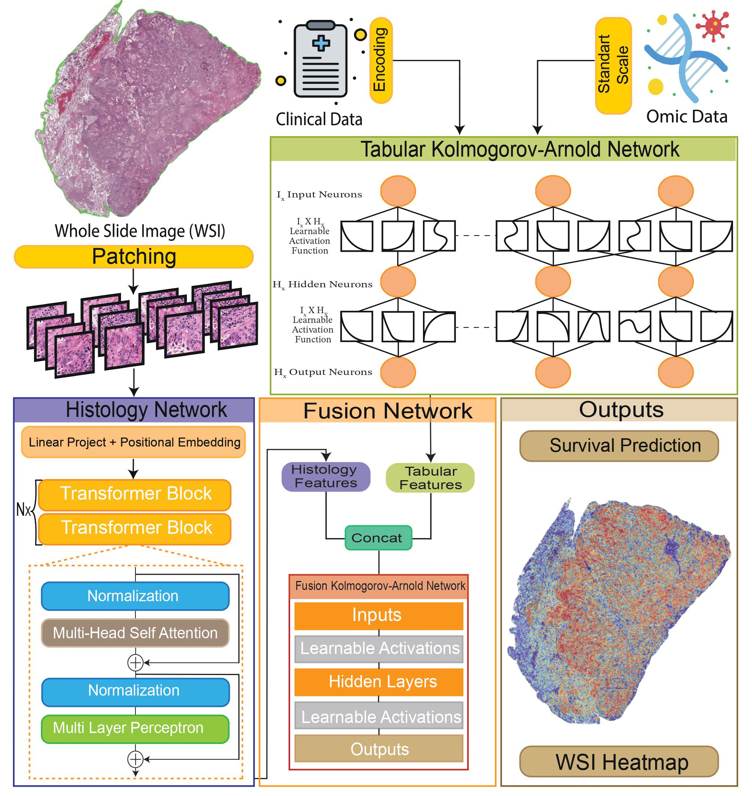

## *VITKAN: Vision Transformer supported Kolmogorov-Arnold Networks for Survival Prediction in Lung Cancer*

>  Lung cancer is one of the most common and
deadly forms of cancer worldwide, influenced by environmental factors, lifestyle choices, and genetics. Finding new
ways to predict survival outcomes for lung cancer patients
in cancer research is crucial. Using whole slide images and
tabular data fusion in deep learning-based survival prediction represents a significant leap in the field; however,
these techniques fail to capture the complexity of histological and tabular features, struggle to effectively fuse them,
and lack clinical data integration, leading to poor performance in survival prediction applications. In this study, we
aimed to overcome these challenges by presenting novel
Kolmogorov-Arnold Networks for tabular data processing
and Fusion tasks and advanced vision models for histology
image processing. Using publicly accessible datasets and
leveraging clinical and omic data, we have showcased our
proposed method’s superior capabilities in estimating lung
cancer patient’s survival.

Overview of the VITKAN workflow and architecture:
<br>

<br>


## **Installation:**
Clone This Repository:
```
https://github.com/mertgokpinar/VITKAN.git
```
Create a conda environment
```
conda create -n vitkan python==3.10
```
Activate your conda environment
```
conda activate vitkan
```
  Install Requirements
```
pip install -r requirements.txt
```
 Clone Efficient KAN Repo into VITKAN diractory
```bash
cd VITKAN
https://github.com/Blealtan/efficient-kan
```

## **Preparing Datasets**
**Download**

You can access publicly available TCGA-LUAD and TCGA-LUSC datasets from [NIH Genomic Data Commons Data Portal](https://portal.gdc.cancer.gov/). Please follow their instructions to download Diagnostic Whole Slide Image (WSI), Clinical data and Omics data.

**Preprocess**

For preprocessing raw Diagnostic WSI, we used publicly available [Clam](https://github.com/mahmoodlab/CLAM), we divided each WSI into 224x224 patches and extracted WSI features using following publicly available pre-trained histology vision transformer weights listed below.

- [CTransPath](https://github.com/Xiyue-Wang/TransPath)
- [HistoSSL](https://github.com/owkin/HistoSSLscaling)
- [UNI](https://github.com/mahmoodlab/UNI)
- [CONCH](https://github.com/mahmoodlab/CONCH)

**Create Splits**

Example commands given [here](make_split_commands.sh) for creating train/test splits.


## **Training**

**Options**

Before starting any training, it is highly recommended setting data paths, fixed variables and other training options from this [file](options.py).

**Wandb Training**

VITKAN supports training with Weight and Biases, a strong hyperparameter search tool for deep learning models, you can use your own configration file or you can use see example config files from [here](cfg).

You can init your Wandb sweep with:
```python
wandb sweep --project <your_project_name> <your_cfg.yml>
```
Then start your Wandb sweep using:
```python
CUDA_VISIBLE_DEVICES=0 wandb agent <your_sweep_cmd_here>
```
You can use Tmux for training with multiple Wandb Agents at the same time, please refer to [here](run_tmux.sh) for example commands.

**Training without Wandb**

If you want to perform training without Wandb, You can setup your parameters from [here](options.py) and use the example command bellow for training.

```python
CUDA_VISIBLE_DEVICES=0 python train_cv.py --batch_size=8 --exp_name= exp_name --init_type=none --input_size_omic=9 --kan_gridsize=3 --kan_hlayer=2 --lr=0.0008 --lr_policy=linear --mode=SingleVisionNet_KAN --wandb=0
```


## **Testing**

For testing the models, you can use the bellow script. Make sure to set correct paths for checkpoints_dir, exp_name, model_name from options file.

```python
CUDA_VISIBLE_DEVICES=0 python test_cv.py
```

## **Reference**

If you find our work useful for your research or if you used parts of this code, please consider citing:

```bibtex
@misc{mert2024vitkan,
    title={VITKAN:Vision Transformer supported Kolmogorov-Arnold Networks for Survival Prediction in Lung Cancer},
    author={Gokpinar, M., Almalioglu, Y. and Turan, M.},
    year={2024}
}
```

### **Acknowledgments**

This code uses Kolmogorov-Arnold networks for training you can access their original repo from [here](https://github.com/KindXiaoming/pykan) and paper from [here](https://arxiv.org/abs/2404.19756)

This project was built on [PathomicFusion](https://github.com/mahmoodlab/PathomicFusion)
